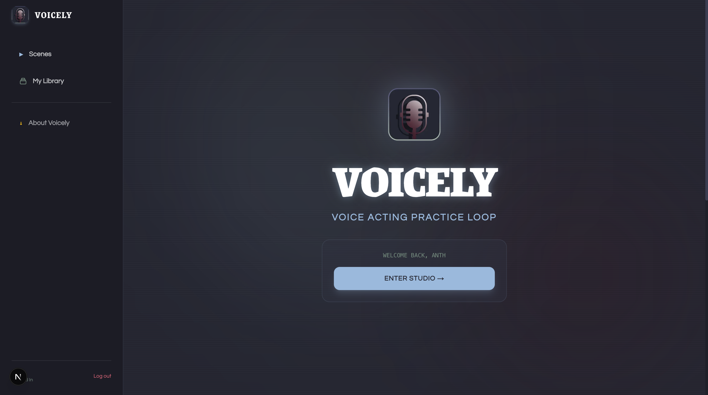

# Voicely

Voice-over practice: record line takes, grade them against scene references, iterate.

Watch demo [HEREEE](https://youtu.be/tY0junGGF5g)!!



## Why

I enjoy story games, but getting stuck in dialogue or cut scenes can get really boring. This is where voice actors shine, and honestly, made me really appreciate it them more when I tried voicing them. 

Voice acting is an Art that we see so much but it's not that recognized in the industry. Anime, Games, Ads; the ALL use voice actor/actresses, this is called voice over. 

I personally do want to try voice acting, but the only way to really practice is through real jobs, and honestly I don't feel prepared for that. 

That's why I built Voicely. You can record YOUR voice over popular / cool scenes (right now its just the one valorant clip). A server side AI using PyTorch to analyze the original audio to your audio, grading it from S+ to F. Will need some fine tuning but works!!! 

Anyways, built for Ignition Hacks V7. Hope you enjoy.

## Architecture

```text
voicely/
  frontend/   Next.js (Bun) — UI, recorder
  backend/    Go (Gin) — public API, proxies grade to Python
  grader/     FastAPI — Resemblyzer scoring
  valorant/   Sample scene media (optional local mounts)
  assets/     Local scene packs / refs
  contracts/  Frozen API shapes
  bruno/      HTTP collection
```

Browser → Next (`:3000`) → Go (`:8080`) → grader (`:8000`).

## Dependencies

| Tool | Why |
|------|-----|
| [Docker Desktop](https://www.docker.com/products/docker-desktop/) | Go API + Python grader via Compose |
| [Bun](https://bun.sh) 1.3+ | Frontend (`packageManager` is `bun@1.3.14`) |
| A Chromium desktop browser | Mic + `MediaRecorder` |

Optional (run services without Docker):

- Go **1.26** — `backend/`
- Python **3.12** + [uv](https://docs.astral.sh/uv/) — `grader/` (Resemblyzer is unreliable on 3.14)
- [ffmpeg](https://ffmpeg.org/) — grader decodes WebM/Opus takes

## Install

```bash
git clone https://github.com/anthskti/voicely
cd voicely

cp frontend/.env.local.example frontend/.env.local
cp backend/.env.example backend/.env         
cp grader/.env.example grader/.env  

cd frontend && bun install && cd ..
```

`frontend/.env.local` (local):

```
NEXT_PUBLIC_GO_BACKEND_URL=http://localhost:8080
```

`backend/.env` should include `FRONTEND_ORIGIN=http://localhost:3000` and `AUTH_COOKIE_SECURE=false` for local cookie auth.

Compose injects Go’s `GRADER_SERVICE_URL` to `http://grader:8000/evaluate`. Postgres is required for scenes, users, and practice sessions.

## Run

**1. API + grader**

```bash
docker compose up --build
```

- Go: [http://localhost:8080/healthz](http://localhost:8080/healthz)
- Grader: [http://localhost:8000/healthz](http://localhost:8000/healthz) (internal evaluate is `POST /evaluate`)

Rebuild after Go/Python changes:

```bash
docker compose up -d --build
```

**2. Frontend**

```bash
cd frontend
bun dev
```

Open [http://localhost:3000](http://localhost:3000).

Stop Compose with `Ctrl+C` or `docker compose down`.

### Without Docker

```bash
# terminal 1
cd grader && uv sync
ASSETS_ROOT=../assets uv run uvicorn main:app --host 0.0.0.0 --port 8000

# terminal 2
cd backend
export PORT=8080 GRADER_SERVICE_URL=http://localhost:8000/evaluate
go run ./cmd/api

# terminal 3
cd frontend && bun dev
```

## Smoke test

Bruno: open `bruno/`, environment **local** (`http://localhost:8080`), run **Grade scene_01 (good takes)**.

```bash
curl -s http://localhost:8080/healthz
```

## Deploy

`render.yaml` — public `voicely-api`, private `voicely-grader`. Frontend is a separate Render web service. Set `GO_BACKEND_URL` (or `NEXT_PUBLIC_GO_BACKEND_URL`) on the frontend to the API origin so Next rewrites `/api/v1` there. The browser must call `/api/v1` on the frontend host — two `*.onrender.com` URLs are cross-site, which breaks login cookies on iOS.

## License

See [LICENSE](LICENSE).

Author: Anthony Pham
